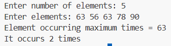

# 📚 DSA Programs

This repository contains a collection of **DSA programming exercises**, implemented in C.
The programs are organized by topic, and each file demonstrates a specific concept with clear and concise code. 
Each program includes its **source code (.c)**, **compiled executable (.exe)**, and the **output screenshot (.png)** for easy reference.   

---

## 📝 Program List  

### 🔹 BASICS  
| Program | Source Code | Output |
|---------|-------------|--------|
| Count occurrence of digits in a number | [OccurenceCount.c](./BASICS/OccurenceCount.c) |  |
| Reverse an array | [ReverseArray.c](./BASICS/ReverseArray.c) |  |
| Reverse a number | [ReverseNum.c](./BASICS/ReverseNum.c) |  |
| Reverse a string | [ReverseString.c](./BASICS/ReverseString.c) |  |
| Powersets Of elements | [PowerSet.c](./BASICS/PowerSet.c) |  |
| Sum of subsets | [SumSubsets.c](./BASICS/SumSubsets.c) |  |
| subset whose sum is equal to the given element | [SumFindSubset.c](./BASICS/SumFindSubset.c) |  |
| Maintain order of +ve , -ve and 0. | [OrderElements.c](./BASICS/OrderElements.c) |  |
| Majority element of array | [MajorityElement.c](./BASICS/MajorityElement.c) |  |

---

### 🔹 ARRAYS  
| Program | Source Code | Output |
|---------|-------------|--------|
| Find largest number in array | [LargestNums.c](./DATA%20STRUCTURES/ARRAYS/LargestNums.c) |  |
| Quick Sort implementation | [QuickSort.c](./DATA%20STRUCTURES/ARRAYS/QuickSort.c) |  |
| Remove duplicates from array | [RemoveDuplicates.c](./DATA%20STRUCTURES/ARRAYS/RemoveDuplicates.c) |  |
| Search element in array | [SearchElement.c](./DATA%20STRUCTURES/ARRAYS/SearchElement.c) |  |

---

### 🔹 STACKS 
| Program | Source Code | Output |
|---------|-------------|--------|
| Implement a Stack using Array | [Stack.c](./DATA%20STRUCTURES/STACKS/Stack.c) |   |
| Infix To Postfix using Stacks | [InfixToPostfix.c](./DATA%20STRUCTURES/STACKS/InfixToPostfix.c) |  |

---

## ⚙️ How to Run  

1. Clone the repository  
   ```bash
   git clone https://github.com/YourUsername/YourRepoName.git
   cd YourRepoName
